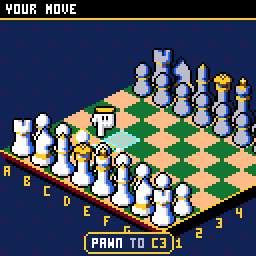
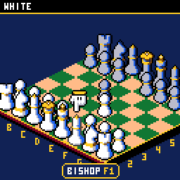
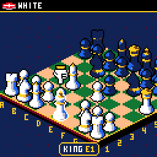
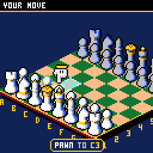
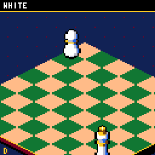

# CHChess

Chess for the [CHGame](https://github.com/bateske/CH32SerialBoot) handheld
(CH32X035 RISC-V, 128x128 colour LCD, piezo), in the casino style of
[CHBlackjack](https://github.com/bateske/CHBlackjack): an isometric board on
a casino carpet, a pointing glove to pick pieces up, legal moves lit with
shimmering, marching borders, a camera that whips in close on every move
(captures play out in slow motion), each move called out ("ROOK TAKES
QUEEN ON A4"),
captured pieces knocked off the board tumbling, CHECK! and CHECKMATE! in
Blackjack's dancing gradient letters, and a CPU opponent whose red glove
hovers over the pieces it is thinking about.

| The CPU's turn | Capture | Checkmate |
|---|---|---|
|  |  |  |
| **Title** | **Look around** | **Promotion** |
|  |  |  |

(Captured from the PC simulator in `tools/chsim`, which runs the real game
and graphics code and renders what the device shows.)

The rules and the CPU are the ch2k engine from
[ArduChess](https://github.com/tiberiusbrown/arduchess) by **Peter Brown
(tiberiusbrown)**, MPL-2.0, in `src/engine/ch2k.hpp` with the changes listed
at its top. The 3x5 lettering is Press Play On Tape's font, as in
CHBlackjack. See `NOTICE`.

## Installing

You need the Arduino IDE (2.x) or `arduino-cli`, and:

1. **The CHGame board package, 0.2.2 or later** (Boards Manager URL
   `https://github.com/bateske/CH32SerialBoot/releases/latest/download/package_chgame_index.json`).
2. **The CHGfx library, 1.2.0** from <https://github.com/bateske/CHgfx>.
3. **This repository**, in a folder named `CHChess`.

The game needs **link-time optimisation** to fit the 50,944-byte application
region (it is 50.2 KB with it, 56 KB without). With a board package that
has it, pick *Tools > Optimize > Smallest + LTO*. From the command line, on
any CHGame package:

    arduino-cli compile -b CHGame:ch32v:CHGame:opt=osstd,rtlib=nano,periph=game --build-property build.extra_flags=-flto CHChess
    arduino-cli upload  -b CHGame:ch32v:CHGame -p COMx CHChess

(`python tools/device.py build` does the same.)

## Playing

| Button | On the board | Elsewhere |
|---|---|---|
| D-pad | move the glove between your pieces, or, holding one, between the squares it can go to | menus |
| A | pick up the piece / put it down there | select |
| B | put the piece back | back |
| B held (+ D-pad) | inspect: the camera zooms right in; the D-pad pushes the view to the board's edges and corners until you let go | |
| SELECT | change view: the board, or the map (from above) | |
| START | pause: resume, undo, resign, save + quit | |

The glove only stops on your own pieces (the one under it fades its outline
black to white, the one you pick up gets a rainbow outline), or, holding
one, on the squares it can go to (the one it is on blinks solid, a piece it
would take flashes red). Each press takes it to the nearest spot in that
direction as the screen shows it (diagonals included, whatever the view);
with nothing that way it wraps round to the
farthest spot the other way, so pressing on steps through them all. A plate
at the foot of the screen names what it is on ("KNIGHT G1", "BISHOP F1 NO
MOVES", "KNIGHT TO F3", "KNIGHT TAKES PAWN"), then calls out each move as
it lands. During your turn the other side's last move is lit in gold.

Check is an event: the king's square marches red, the king flashes red on
a heartbeat, your glove turns red, the board's trim and the top bar go
from gold to red, and the glove only stops on the pieces that can get you
out of it. The camera leans towards
the middle of the board, so the selection is always in view without empty
carpet at the edges.

Play one or two players. Against the CPU, choose your side and one of five
opponents:

| Opponent | |
|---|---|
| BEGINNER | still learning the moves: picks any move not much worse than the best |
| CLUB PLAYER | solid, but slips up |
| EXPERT | punishes mistakes |
| MASTER | plays to win, not draw |
| GRANDMASTER | its best move, every time |

The weaker opponents choose at random among moves within a margin of the
best one, so they make human-looking mistakes rather than random blunders.
Your record against each is on the opponent screen (hold SELECT there to
clear it). Options: sound, board colour (green, blue, red, purple felt),
move hints, coordinates, and the pace (FUN, or QUICK: faster CPU turns and moves,
and no zooming in on them). Options, records and a game in
progress (SAVE + QUIT, then CONTINUE) are saved to flash and survive
re-uploading.

## How it fits

* **The engine** (ch2k, ~12 KB) is ArduChess's: a 0x88 board with fully
  legal move generation, alpha-beta with quiescence search, a Texel-tuned
  evaluation and an opening book, cut here to four plies. It runs
  synchronously; every 8 nodes it calls back into the game. The search
  runs flat out, stopping every two seconds for a short burst of full-rate
  frames in which the CPU's glove glides to the piece it is weighing (a
  button press, or a menu, gets frames at once).
* **The board** is drawn as 2:1 diamonds sampled at pixel centres, so every
  edge is a clean staircase at every zoom step (tiles 20x10 up to 40x20, a
  pixel at a time); pieces are span-encoded sprites rendered from 3D models
  (`tools/pieces.py`), one set recoloured for each side, scaled as the
  camera zooms and stood on a flat grid for the map.
* **Undo and saved games** replay the move list from the start (or from a
  snapshot, in long games), which also keeps the opening book and the
  repetition rule right.

## Development

The tools need Python 3 with `pip install -r tools/requirements.txt`, and a
C++ compiler (zig, clang++ or g++ on the PATH, `pip install ziglang`, or
`CHSIM_CXX="path/to/zig c++"`).

* `python tools/tests/run_tests.py` - move generation counts (perft) on five
  positions, the draw rules, the opening book, snapshots, the CPU at every
  level, and ~100,000 moves of fuzzed games through the game logic with undo
  and save/load.
* `python tools/chsim/chdrive.py --sim . tools/scripts/showcase.txt docs/` -
  runs the game from a script and writes the GIFs above. `say X <fen>` sets
  up a position, `say M <from> <to>` plays a move (squares 0 = a1 .. 63 = h8).
  `cal` and `perf` in a script estimate the device's render time.
* `python tools/device.py upload [--debug]` - build and upload (`--debug`
  adds the serial protocol for screenshots, injected input and lockstep).
* **Editing the art:** `python tools/sheet.py export` writes
  `tools/art/sheet.png`, an indexed PNG on the game's palette (transparent
  background, swatch included): the pieces and glove as drawn (MASTER), the
  pieces as White and as Black, and the palette swap between them as a key.
  Edit it (Photoshop keeps it indexed), then `python tools/sheet.py import`
  turns MASTER edits into `tools/art/pieces/` and the glove, recolouring on
  the White/Black rows or the key into `tools/art/sides.txt`, and rebuilds
  the assets. Details at the top of `tools/sheet.py`.
* `python tools/pieces.py` renders the pieces, `python tools/assets.py`
  packs the art, `python tools/book.py N` cuts the opening book to N plies,
  `python tools/audio/preview.py out/` renders the sound effects to WAV.

## License

Apache License 2.0 (`LICENSE`), except `src/engine/ch2k.hpp`, which is
MPL-2.0 (`LICENSE.MPL-2.0`). See `NOTICE`.
